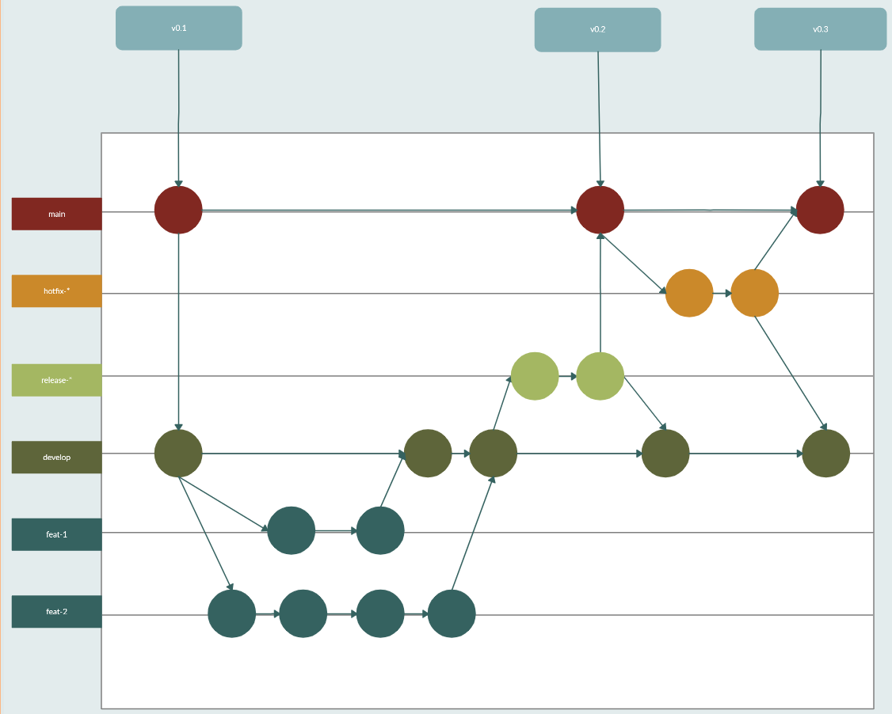

# Movie-analyst-devops v0.1
Automation of movie-analyst app deployment.

## Usage

Clone the repo.

`git clone https://github.com/jocamp18/movie-analyst-devops`

Enter to the repo directory and execute vagran command to start the machines.

`cd movie-anayst-devops`

`vagrant up`

Now the base machines will be available and the UI will be working on a virtual machine called frontend and the API on a virtual machine called backend.

## Git branching model

Main branches

* main: Production branch, it is a production-ready state.
* develop: Development branch, where code is generally in the latest state.

Supporting branches

* Feature: This branch is used to introduce new characteristics to our app. The name of this kind of branches should start by "feat-". After the characteristic is ready, it should be merged with develop.
* Release: This branch is used to check the last details previous going to the production stage. The name of this kind of branches should start by "release-". After the realese is ready, it should be merged with develop and master.
* Hotfix: This branch is used to solve a critical bug that was identified in the main branch. The name of this kind of branches should start by "hotfix-". When the bug is fixed, it should be merged with develop and main.

Watch it better at: https://app.creately.com/diagram/Ukr9r9XnHm4

Read more at: https://nvie.com/posts/a-successful-git-branching-model/

